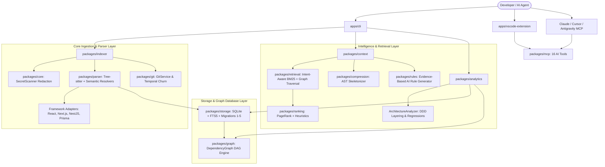

# CodeAtlas Architecture & System Design 🗺️

> **The Local-First Context Intelligence & Architecture Engine for AI Coding Agents**

This document provides a comprehensive technical overview of the CodeAtlas codebase, design decisions, data structures, and the relationships between the packages in this monorepo.

---

## 🏛️ High-Level System Architecture

CodeAtlas operates strictly **local-first** without external cloud dependencies. It converts raw source code into an AST-backed Knowledge Graph in SQLite, exposing high-level architectural intelligence to AI Coding Agents (such as Google Antigravity, Claude Code, Cursor, Windsurf, and Copilot) via CLI, VS Code Extension, and the Model Context Protocol (MCP).

---

## 📦 Monorepo Package Breakdown

The monorepo is managed with `pnpm` workspaces and `tsup` for ultra-fast ESM/DTS builds across internal packages and application runtimes:

### 1. Delivery & Applications (`apps/`)

| App                         | Description                                                                                                                                                                                |
| :-------------------------- | :----------------------------------------------------------------------------------------------------------------------------------------------------------------------------------------- |
| **`apps/cli`**              | The main developer CLI executable (`atlas`). Handles commands like `init`, `scan`, `index`, `context`, `diff`, `doctor`, `watch`, `analyze`, `rules`, and `mcp`.                          |
| **`apps/vscode-extension`** | VS Code / Cursor extension providing a visual Knowledge Graph viewer, code lens context triggers, and local server bridge.                                                                 |
| **`apps/mcp-server`**       | Standalone stdio MCP server entry point exposing 16 specialized tools for direct integration into AI agent runners.                                                                        |
| **`apps/docs`**             | VitePress documentation portal containing full guides, architecture deep-dives, CLI reference, and API contracts.                                                                          |
| **`apps/webview`**          | React force-directed 2D/3D graph visualization canvas for exploring repository dependencies.                                                                                              |

---

### 2. Ingestion & Syntactic Layer (`packages/`)

| Package                     | Description                                                                                                                                                                                                                                               |
| :-------------------------- | :-------------------------------------------------------------------------------------------------------------------------------------------------------------------------------------------------------------------------------------------------------- |
| **`@codeatlas-ai/core`**    | Core domain models (`SymbolInfo`, `FileInfo`, `ContextPack`, `RuleConfig`), language mappings, and the **`SecretScanner`** redaction engine that scrubs API keys, private keys, JWTs, and passwords from index databases and LLM payloads.                 |
| **`@codeatlas-ai/parser`**  | Multi-language Tree-sitter AST parser, **TypeScript Semantic Resolver** (resolving `extends`, `implements`, and `tsconfig.json` path mappings `@/*`), and **Framework Adapters** (React Hooks `use*`, Next.js App Router, NestJS DI, Prisma Schema).   |
| **`@codeatlas-ai/indexer`** | Directory walker, stack auto-detection (`Scanner`), batch AST extraction with concurrent worker pools, and real-time incremental watcher (`Watcher`). Applies secret redaction on raw disk reads before indexing.                                        |
| **`@codeatlas-ai/git`**     | Native Git CLI wrapper for tracking staged files, churn metrics, branch diffs, commit history, and co-change frequencies.                                                                                                                                 |

---

### 3. Knowledge Graph & Storage Layer

| Package                           | Description                                                                                                                                                                                      |
| :-------------------------------- | :----------------------------------------------------------------------------------------------------------------------------------------------------------------------------------------------- |
| **`@codeatlas-ai/storage`**       | SQLite embedded engine with WAL mode and SQLite FTS5 full-text search (BM25 ranking). Manages automatic database migrations (Schema 1–5: initial schema, embeddings, complexity, confidence, git metrics). |
| **`@codeatlas-ai/graph`**         | Directed Acyclic Graph (DAG) computation engine. Calculates blast radius, transitive dependencies, resolution confidence scores, and graph topological sorting.                                   |
| **`@codeatlas-ai/token-counter`** | Deterministic token counting engine compatible with GPT-4, Claude, and Gemini tokenizers.                                                                                                        |

---

### 4. Intelligence, Analytics & Retrieval

| Package                         | Description                                                                                                                                                                                                                                 |
| :------------------------------ | :------------------------------------------------------------------------------------------------------------------------------------------------------------------------------------------------------------------------------------------ |
| **`@codeatlas-ai/analytics`**   | Codebase health & architecture engine: **`ArchitectureAnalyzer`** (DDD 5-tier layer classification, regression detection, public API boundary bypasses), dead code detection, cyclomatic complexity hotspots, and taint tracking.          |
| **`@codeatlas-ai/retrieval`**   | Hybrid search engine combining FTS5 keyword BM25 scoring with Graph proximity traversal. Supports task-intent routing (`--intent bug`, `feature`, `refactor`).                                                                             |
| **`@codeatlas-ai/ranking`**     | Multi-factor ranker: adjusts file scores based on graph centrality, PageRank, recency, import depth, and temporal git churn.                                                                                                                |
| **`@codeatlas-ai/compression`** | AST Skeletonizer. Compresses large files into type signatures and interface outlines with automatic secret redaction to save up to 92% token budgets.                                                                                      |
| **`@codeatlas-ai/rules`**       | Discovers, validates, and standardizes AI coding rules (`AGENTS.md`, `CLAUDE.md`, `.cursorrules`). Features **`RuleGenerator`** with evidence citations, interactive prompts, and `--proposal` generation.                                  |
| **`@codeatlas-ai/context`**     | Assembles the final `ContextPack` respecting token budgets, file compression modes, task intent, and visual directory tree structures.                                                                                                     |

---

### 5. AI Protocols & Querying

| Package                       | Description                                                                                                                                                 |
| :---------------------------- | :---------------------------------------------------------------------------------------------------------------------------------------------------------- |
| **`@codeatlas-ai/mcp`**       | Model Context Protocol (MCP) server implementation with 16 high-level agent tools (`atlas_trace_execution_path`, `atlas_security_audit`, `atlas_plan_feature`). |
| **`@codeatlas-ai/nl2cypher`** | Translates natural language questions into deterministic Cypher-like queries on the graph.                                                                 |

---

## 🗄️ SQLite Database Schema & Migrations

CodeAtlas uses schema migrations to evolve `.atlas/atlas.db`:

1. **Migration 1 (`initial_schema`)**: `projects`, `files`, `symbols`, `dependencies`, `rules`, and SQLite FTS5 search virtual tables.
2. **Migration 2 (`embeddings_table`)**: Vector embedding storage table for future semantic indexing.
3. **Migration 3 (`add_cyclomatic_complexity`)**: Adds `cyclomatic_complexity` column to `symbols` table for AST structural complexity calculation.
4. **Migration 4 (`add_dependency_confidence_and_resolution`)**: Adds `confidence` (0.0 to 1.0) and `resolution_reason` to `dependencies` table for tracking resolved TypeScript semantics.
5. **Migration 5 (`create_git_metrics_table`)**: Adds `git_metrics` table (`file_id`, `commit_count`, `last_modified`, `churn_score`) for temporal change analysis.

---

## 🔒 Security Architecture (Redaction Layer)

To protect developer secrets and corporate intellectual property, CodeAtlas implements an in-memory `SecretScanner` layer:

- **Regex Entropy Engine**: Matches Private Keys (RSA, EC, OpenSSH, PGP), Cloud API keys (Anthropic, OpenAI, AWS, GCP, GitHub, Slack, Stripe), JWT tokens, and database URI passwords.
- **Ingestion Interception**: Raw file contents read by `Indexer` are sanitized before hashing, AST parsing, and insertion into SQLite FTS tables.
- **Egress Interception**: MCP tool outputs and compression engines sanitize code before streaming JSON-RPC responses to external LLMs.
