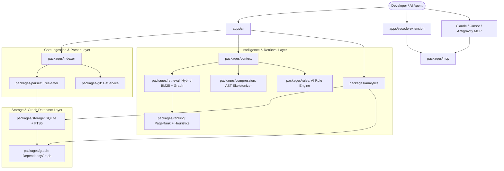

# CodeAtlas Architecture & System Design 🗺️

> **The Local-First Context Intelligence & Architecture Engine for AI Coding Agents**

This document provides a comprehensive technical overview of the CodeAtlas codebase, design decisions, data structures, and the relationships between the packages in this monorepo.

---

## 🏛️ High-Level System Architecture

CodeAtlas operates strictly **local-first** without external cloud dependencies. It converts raw source code into an AST-backed Knowledge Graph in SQLite, exposing high-level architectural intelligence to AI Coding Agents (such as Google Antigravity, Claude Code, Cursor, Windsurf, and Copilot) via CLI, VS Code Extension, and the Model Context Protocol (MCP).



---

## 📦 Monorepo Package Breakdown

The monorepo is managed with `pnpm` workspaces and `tsup` for ultra-fast ESM/DTS builds across 19 internal packages and 3 application runtimes:

### 1. Delivery & Applications (`apps/`)

| App                         | Description                                                                                                                                  |
| :-------------------------- | :------------------------------------------------------------------------------------------------------------------------------------------- |
| **`apps/cli`**              | The main developer CLI executable (`atlas`). Handles commands like `init`, `scan`, `index`, `context`, `diff`, `doctor`, `watch`, and `mcp`. |
| **`apps/vscode-extension`** | VS Code / Cursor extension providing a visual Knowledge Graph viewer, code lens context triggers, and local server bridge.                   |
| **`apps/mcp-server`**       | Standalone stdio MCP server entry point for direct integration into AI agent runners.                                                        |

---

### 2. Ingestion & Syntactic Layer (`packages/`)

| Package                     | Description                                                                                                                        | Key Responsibilities                        |
| :-------------------------- | :--------------------------------------------------------------------------------------------------------------------------------- | :------------------------------------------ |
| **`@codeatlas-ai/core`**    | Core TypeScript type definitions, domain models (`SymbolInfo`, `FileInfo`, `ContextPack`, `Rule`), and configuration schemas.      | Shared types across all packages            |
| **`@codeatlas-ai/parser`**  | Multi-language Tree-sitter AST parser. Extracts functions, classes, interfaces, method calls, and module import/export statements. | Syntax parsing without compilation overhead |
| **`@codeatlas-ai/indexer`** | Directory walker, stack auto-detection (`Scanner`), batch AST extraction, and real-time incremental watcher (`Watcher`).           | Orchestrating parallel codebase indexing    |
| **`@codeatlas-ai/git`**     | Native Git CLI wrapper for tracking staged files, churn metrics, branch diffs, and co-change frequencies.                          | Blast radius & git history metrics          |

---

### 3. Knowledge Graph & Storage Layer

| Package                           | Description                                                                                                                       | Key Responsibilities                   |
| :-------------------------------- | :-------------------------------------------------------------------------------------------------------------------------------- | :------------------------------------- |
| **`@codeatlas-ai/storage`**       | SQLite embedded engine with WAL mode and SQLite FTS5 full-text search (BM25 ranking). Manages automatic database migrations.      | Local persistence in `.atlas/atlas.db` |
| **`@codeatlas-ai/graph`**         | Directed Acyclic Graph (DAG) computation engine. Calculates blast radius, transitive dependencies, and graph topological sorting. | In-memory graph traversal              |
| **`@codeatlas-ai/token-counter`** | Deterministic token counting engine compatible with GPT-4, Claude, and Gemini tokenizers.                                         | Token budget accounting                |

---

### 4. Intelligence, Analytics & Retrieval

| Package                         | Description                                                                                                                          | Key Responsibilities                  |
| :------------------------------ | :----------------------------------------------------------------------------------------------------------------------------------- | :------------------------------------ |
| **`@codeatlas-ai/analytics`**   | Codebase health engine: detects dead code/orphan symbols, cyclomatic complexity hotspots, circular dependencies, and taint tracking. | Architectural linting & quality score |
| **`@codeatlas-ai/retrieval`**   | Hybrid search engine combining FTS5 keyword BM25 scoring with Graph proximity traversal.                                             | Finding candidate files for a prompt  |
| **`@codeatlas-ai/ranking`**     | Multi-factor ranker: adjusts file scores based on graph centrality, PageRank, recency, and import depth.                             | Prioritizing most crucial code        |
| **`@codeatlas-ai/compression`** | AST Skeletonizer. Compresses large files into type signatures and interface outlines to save up to 80% tokens.                       | Non-destructive context shrinking     |
| **`@codeatlas-ai/rules`**       | Discovers, validates, and standardizes AI coding rules (`AGENTS.md`, `CLAUDE.md`, `.cursorrules`).                                   | Guardrails for AI agent behavior      |
| **`@codeatlas-ai/context`**     | Assembles the final `ContextPack` respecting token budgets, file compression modes, and visual directory tree structures.            | Token-budgeted AI prompt packing      |

---

### 5. AI Protocols & Querying

| Package                           | Description                                                                                                                           | Key Responsibilities          |
| :-------------------------------- | :------------------------------------------------------------------------------------------------------------------------------------ | :---------------------------- |
| **`@codeatlas-ai/mcp`**           | Model Context Protocol (MCP) server implementation with high-level agent tools (`atlas_detect_dead_code`, `atlas_complexity_report`). | Stdio RPC for AI assistants   |
| **`@codeatlas-ai/nl2cypher`**     | Translates natural language questions into deterministic Cypher-like queries on the graph.                                            | Graph exploration             |
| **`@codeatlas-ai/exporters`**     | Exports graph structures and context packs into Markdown, JSON, and Mermaid visual diagrams.                                          | Documentation generation      |
| **`@codeatlas-ai/github-action`** | Reusable GitHub Action for PR architectural blast-radius checks in CI/CD.                                                             | Automated code reviews in CI  |
| **`@codeatlas-ai/shared`**        | Common logging, error handling, result types (`Result<T, E>`), and string/formatting utilities.                                       | Shared cross-cutting concerns |

---

## 🔄 End-to-End Data Flow

### 1. Ingestion Pipeline (`atlas index`)

```text
Source Files (*.ts, *.py, *.go, ...)
   │
   ▼
Scanner (Stack & Ignore Detection)
   │
   ▼
Tree-Sitter AST Parser (Parallel Worker Pool)
   │
   ├── Extracted Symbols (functions, classes, interfaces, complexity)
   ├── Extracted Imports (ESM, CJS, dynamic imports, standard libraries)
   └── Extracted Calls (function calls, instantiation)
   │
   ▼
SQLite Storage Layer (.atlas/atlas.db)
   ├── Table: files & fts_files (FTS5 BM25 index)
   ├── Table: symbols & fts_symbols
   └── Table: dependencies (Caller -> Callee Directed Graph)
```

### 2. Context Retrieval Pipeline (`atlas context "task"`)

```text
Task Query (e.g. "Add Stripe Webhook Handler")
   │
   ▼
Retrieval Engine (FTS5 Keyword Search + Graph Proximity Expansion)
   │
   ▼
Ranker Engine (Multi-Factor Scoring: Lexical + Graph Centrality + Recency)
   │
   ▼
Context Engine (Token Budget Optimization)
   ├── Tier 1 (Relevance > 80%): [Full Content]
   ├── Tier 2 (Relevance 50%-80%): [AST Signature / Skeleton]
   └── Tier 3 (Relevance < 50%): [Type Outline / Digest]
   │
   ▼
Final Context Pack (Markdown / Directory Tree / Rules / Token Meter)
```

---

## 🗄️ Database Schema

The embedded SQLite database (`.atlas/atlas.db`) uses standard normalized relational tables combined with virtual FTS5 tables:

```sql
-- Core Project Metadata
CREATE TABLE projects (
    id TEXT PRIMARY KEY,
    name TEXT NOT NULL,
    root_dir TEXT NOT NULL,
    languages TEXT,
    frameworks TEXT,
    workspaces TEXT,
    created_at INTEGER
);

-- File Registry & Checksums
CREATE TABLE files (
    id TEXT PRIMARY KEY,
    project_id TEXT NOT NULL,
    relative_path TEXT NOT NULL,
    language TEXT NOT NULL,
    size_bytes INTEGER,
    hash TEXT NOT NULL,
    last_modified INTEGER
);

-- Symbol Definitions & Cyclomatic Complexity
CREATE TABLE symbols (
    id TEXT PRIMARY KEY,
    project_id TEXT NOT NULL,
    file_id TEXT NOT NULL,
    name TEXT NOT NULL,
    kind TEXT NOT NULL,     -- 'function', 'class', 'interface', 'variable'
    line_start INTEGER,
    line_end INTEGER,
    cyclomatic_complexity INTEGER DEFAULT 1
);

-- Graph Edges (Directed Call & Import Graph)
CREATE TABLE dependencies (
    id TEXT PRIMARY KEY,
    project_id TEXT NOT NULL,
    source_file_id TEXT NOT NULL,
    target_file_id TEXT NOT NULL,
    import_type TEXT NOT NULL -- 'static', 'dynamic', 'type_only'
);
```

---

## 🔒 Security & Privacy by Design

- **100% Offline**: CodeAtlas never sends source code or AST tokens to any remote server or third-party cloud.
- **Secret Scanning**: Scans and excludes sensitive files (`.env`, `*.pem`, `*.key`, AWS credentials) before indexing.
- **Read-Only Context**: Tools exposed over MCP are strictly read-only and cannot mutate local files without explicit agent/user execution.

---

## 🧪 Testing & Verification

The entire monorepo is rigorously tested using Vitest:

- **105 Unit & Integration Tests**: 100% passing across 22 test suites.
- **End-to-End AST Validation**: Multi-language AST parsing verified against TypeScript, JavaScript, Python, Go, Rust, Java, C#, and PHP code snippets.
- **Zero-Config Typecheck**: Strict TypeScript compilation with `tsc --noEmit` across all 26 workspace projects.
