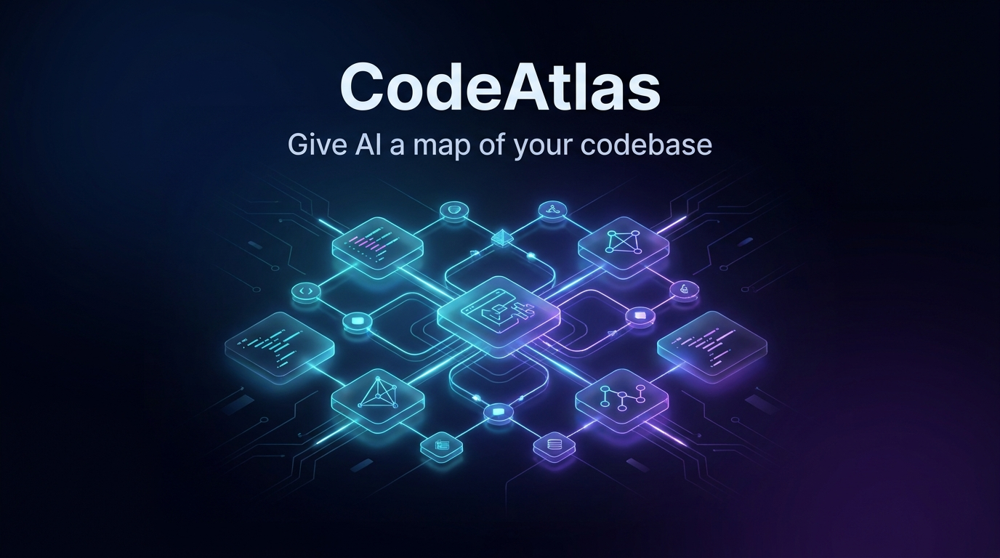

<div align="center">
  
</div>

# CodeAtlas

> **The Local-First Context Intelligence & Architecture Graph Engine for AI Coding Agents**

CodeAtlas indexes codebases into a high-performance **Knowledge Graph** stored locally in SQLite (`.atlas/atlas.db`). It provides static dependency analysis, architectural health metrics, AST skeletonization, and Model Context Protocol (MCP) integrations to ground AI coding assistants (**Google Antigravity**, **Claude Code**, **Cursor**, **Windsurf**, **Copilot**) in actual repository structure.

[](https://marketplace.visualstudio.com/items?itemName=shditz.codeatlas-official)
[](https://github.com/shditz/codeatlas/actions)
[-brightgreen.svg>)](https://github.com/shditz/codeatlas)
[](https://opensource.org/licenses/MIT)
[](https://www.typescriptlang.org/)
[](https://nodejs.org/)

---

## 📑 Table of Contents

- [Installation & Quickstart](#-installation--quickstart)
- [Repository Structure](#-repository-structure)
- [How It Works](#-how-it-works)
- [Language & Framework Support](#-language--framework-support)
- [CLI Reference](#-cli-reference)
- [Model Context Protocol (MCP)](#-model-context-protocol-mcp)
- [Configuration](#-configuration)
- [Empirical Benchmarks](#-empirical-benchmarks)
- [Local Development](#-local-development)
- [License](#-license)

---

## ⚡ Installation & Quickstart

### 1. VS Code & Cursor Extension

Install directly from the official **Visual Studio Marketplace**:

- **Marketplace:** Search for [**`CodeAtlas`** (`shditz.codeatlas-official`)](https://marketplace.visualstudio.com/items?itemName=shditz.codeatlas-official) in the Extensions tab (`Ctrl+Shift+X` / `Cmd+Shift+X`).
- **Terminal:**
  ```bash
  code --install-extension shditz.codeatlas-official
  ```
  _(For Cursor: `cursor --install-extension shditz.codeatlas-official`)_

### 2. Global CLI

```bash
npm install -g @codeatlas-ai/cli
```

### 3. Initialize & Index a Project

Run within any repository root:

```bash
# Auto-detect project stack and create local .atlas/ directory
atlas init

# Parse ASTs, compute metrics, and build local graph database
atlas index
```

### 4. Connect AI Coding Assistants (MCP Setup)

Automatically configure MCP for all detected AI assistants (Cursor, Claude, Antigravity, Windsurf):

```bash
atlas mcp setup --all
```

---

## 📦 Repository Structure

CodeAtlas is organized as a monorepo managed with `pnpm` workspaces:

```
codeatlas/
├── packages/
│   ├── core/           # Core domain models, interfaces, config, and SecretScanner
│   ├── parser/         # Tree-sitter parsers, framework adapters, and TS semantic resolver
│   ├── storage/        # SQLite database, schema migrations, and FTS5 full-text search
│   ├── graph/          # Directed graph engine, PageRank, Louvain clustering, Cypher query
│   ├── analytics/      # Architecture analyzer, DDD layers, Tarjan cycles, Multi-Repo mesh
│   ├── rules/          # Rule generator and live architecture DAG synchronization
│   ├── retrieval/      # Multi-source retrieval engine (FTS5 + Graph expansion)
│   ├── compression/    # AST skeletonizer and token compression algorithms
│   ├── ranking/        # Relevance scoring, PageRank weighting, and Reciprocal Rank Fusion
│   ├── context/        # Context pack builder and token budget optimization
│   ├── mcp/            # Model Context Protocol server (16 tools) & auto-configurator
│   ├── git/            # Git service for commit history, churn metrics, and diff analysis
│   ├── llm/            # LLM provider abstractions and local embedding interfaces
│   ├── shared/         # Shared utility functions, logger, error types, and path helpers
│   ├── github-action/  # GitHub Actions integration for CI/CD architecture gates
│   └── benchmark/      # Empirical benchmark suite for recall and token reduction
├── apps/
│   ├── cli/            # Standalone `atlas` command-line executable
│   ├── vscode-extension/# Official VS Code / Cursor extension
│   ├── webview/        # 2D/3D WebGL force-directed graph canvas (Three.js / Force Graph)
│   ├── docs/           # VitePress documentation portal
│   └── mcp-server/     # Standalone MCP stdio binary runner
```

---

## 🔬 How It Works

```
┌─────────────────┐       AST & Semantics       ┌────────────────────────┐
│  Source Code    │ ──────────────────────────> │   CodeAtlas Engine     │
│  (Disk / Git)   │ <────────────────────────── │ (.atlas/atlas.db)      │
└─────────────────┘   Auto Linter & QuickFix    └───────────┬────────────┘
                                                            │
                            ┌───────────────────────────────┴───────────────────────────────┐
                            ▼                                                               ▼
             ┌─────────────────────────────┐                                 ┌─────────────────────────────┐
             │    VS Code / Cursor IDE     │                                 │     AI Coding Assistants    │
             │  • 2D/3D WebGL Canvas       │                                 │  • 16 Native MCP Tools      │
             │  • 7-Mode Architecture Map  │                                 │  • Live DAG Rules Sync      │
             │  • Live Blast Radius Status │                                 │  • Skeletonized AST Prompts │
             │  • CodeLens Graph Spotlight │                                 │  • 92% Token Savings        │
             └─────────────────────────────┘                                 └─────────────────────────────┘
```

1. **Local-First Indexing & Secret Redaction**: The scanner walks the repository, passes buffers through `SecretScanner` (redacting API keys, JWTs, credentials), and parses Abstract Syntax Trees using Tree-sitter grammars.
2. **Semantic Resolution**: Resolves relative imports, `tsconfig.json` path mappings (`@/*`), and type inheritance hierarchies (`extends` / `implements`) into discrete dependency edges.
3. **Graph Storage & Centrality Analysis**: Stores nodes (files, symbols) and edges in SQLite (`.atlas/atlas.db`). Computes Google PageRank, Louvain modularity clusters, Martin's instability metrics ($I = \frac{C_e}{C_a + C_e}$), and Tarjan cycle detection.
4. **Editor Integration**: Provides real-time Diagnostics (circular dependencies, layer leaks), QuickFix code actions, a Status Bar Blast Radius monitor, and an interactive 2D/3D WebGL visualizer.
5. **AI Synchronization & MCP**: Exposes 16 MCP tools over `stdio` and synchronizes live DAG architecture summaries into `.cursorrules`, `CLAUDE.md`, `AGENTS.md`, and `GEMINI.md`.

---

## 🌐 Language & Framework Support

| Tier                         | Language / Framework     | Extensions                       | Capabilities                                                                |
| :--------------------------- | :----------------------- | :------------------------------- | :-------------------------------------------------------------------------- |
| **Tier 1 (AST & Semantics)** | **TypeScript / TSX**     | `.ts`, `.tsx`, `.mts`, `.cts`    | Type Inheritance, `@/*` Path Mappings, React Hooks, Next.js App Router      |
|                              | **JavaScript / JSX**     | `.js`, `.jsx`, `.mjs`, `.cjs`    | CommonJS, ES Imports, Functions, Classes, JSX Components                    |
|                              | **NestJS**               | `.ts`                            | Controllers (`@Controller`), Providers (`@Injectable`), Modules (`@Module`) |
|                              | **Prisma**               | `.prisma`                        | Models, Relations, Enums, Database Schema Relational Graph                  |
|                              | **Python**               | `.py`                            | Classes, Methods, Functions, Module Imports (`from x import y`)             |
|                              | **Go**                   | `.go`                            | Structs, Interfaces, Methods, Functions, Package Imports                    |
|                              | **Rust**                 | `.rs`                            | Structs, Enums, Traits, `impl` blocks, `use` declarations                   |
|                              | **Dart / Flutter**       | `.dart`                          | Classes, Mixins, Async Methods, Package Imports                             |
|                              | **Scala**                | `.scala`, `.sc`                  | Case Classes, Traits, Companion Objects, Package Imports                    |
|                              | **Lua**                  | `.lua`                           | Modules, Functions, Methods, `require(...)` Calls                           |
|                              | **Elixir & Erlang**      | `.ex`, `.exs`, `.erl`            | Modules, Functions, Includes, Aliases                                       |
|                              | **Zig**                  | `.zig`                           | Structs, Public Functions, `@import(...)`                                   |
|                              | **GraphQL**              | `.graphql`, `.gql`               | Types, Inputs, Interfaces, Queries, Mutations                               |
|                              | **Vue / Svelte / Astro** | `.vue`, `.svelte`, `.astro`      | Script AST Extraction, Component Symbols, Relative Imports                  |
|                              | **SQL Schemas**          | `.sql`                           | Table Definitions, Views, Stored Procedures                                 |
| **Tier 2 (Structural)**      | **Java & C#**            | `.java`, `.cs`                   | Classes, Interfaces, Methods, Namespaces, Imports                           |
|                              | **C / C++**              | `.c`, `.cpp`, `.h`, `.hpp`       | Functions, Structs, Classes, Header Includes                                |
|                              | **PHP / Ruby / Kotlin**  | `.php`, `.rb`, `.kt`             | Classes, Modules, Functions, Namespaces                                     |
| **Tier 3 (Search & Data)**   | **Config & Docs**        | `.json`, `.yaml`, `.toml`, `.md` | SQLite FTS5 BM25 Full-Text Search & Token Counting                          |

---

## 🛠️ CLI Reference

| Command                | Description                                                                              |
| :--------------------- | :--------------------------------------------------------------------------------------- |
| `atlas init`           | Auto-detects project stack, creates `.atlas/config.toml` and `.atlasignore`.             |
| `atlas scan`           | Scans workspace structure, detecting monorepos, workspaces, and languages.               |
| `atlas index`          | Parses AST with Tree-sitter, calculates complexity, and builds dependency graph.         |
| `atlas watch`          | Watches for file modifications and updates the graph incrementally in real time.         |
| `atlas analyze`        | Audits DDD layer regressions (`--architecture`), dead code, and circular dependencies.   |
| `atlas diff`           | Calculates semantic blast radius and breaking change risks from Git diffs.               |
| `atlas doctor`         | Runs integrity checks on the SQLite database and index health.                           |
| `atlas rules list`     | Lists all discovered AI rule files.                                                      |
| `atlas rules validate` | Validates rule consistency and detects conflicting instructions.                         |
| `atlas rules generate` | Generates evidence-based guidelines (`AGENTS.md`, `CLAUDE.md`, `.cursorrules`).          |
| `atlas context`        | Generates token-budgeted prompt packs tailored to intent (`bug`, `feature`, `refactor`). |
| `atlas export`         | Exports context packs into Markdown files for manual LLM chat sessions.                  |
| `atlas search`         | Searches code via SQLite FTS5 BM25 with synonym expansion.                               |
| `atlas query`          | Traverses dependency graph via Natural Language or Cypher queries.                       |
| `atlas map`            | Displays hierarchical ASCII tree map of directories and exported symbols.                |
| `atlas mcp setup`      | Configures detected AI coding assistants to use CodeAtlas MCP server.                    |
| `atlas mcp`            | Starts the Model Context Protocol (MCP) server over `stdio`.                             |
| `atlas clean`          | Cleans local cache, database, and temporary snapshots.                                   |

---

## 🤖 Model Context Protocol (MCP)

CodeAtlas exposes 16 tools over `stdio` compliant with the [Model Context Protocol](https://modelcontextprotocol.io/):

| Tool Name                        | Purpose                                                                       |
| :------------------------------- | :---------------------------------------------------------------------------- |
| `atlas_trace_execution_path`     | Traces call chains upwards to entry points or downwards to leaf dependencies. |
| `atlas_calculate_change_surface` | Calculates cascading blast radius before making code modifications.           |
| `atlas_plan_feature`             | Produces an evidence-based multi-file implementation roadmap.                 |
| `atlas_security_audit`           | Runs SAST security taint analysis and secret detection.                       |
| `atlas_analyze`                  | Audits DDD layer regressions, circular imports, and dead code.                |
| `atlas_get_context`              | Delivers intent-tailored, token-optimized context packs.                      |
| `atlas_compress`                 | Generates token-compressed AST skeletons with redacted secrets.               |
| `atlas_graph_query`              | Traverses the dependency graph using Cypher / graph queries.                  |
| `atlas_search`                   | BM25 full-text search with synonym query expansion.                           |
| `atlas_pr_diff`                  | Evaluates Git diffs and outputs PR architectural impact reports.              |
| `atlas_find_entry_points`        | Discovers controllers, routes, CLI handlers, and public APIs.                 |
| `atlas_get_map`                  | Returns an ASCII directory and exported symbol tree.                          |
| `atlas_get_rules`                | Discovers and validates active AI coding rules.                               |
| `atlas_doctor`                   | Checks SQLite database integrity and repository readiness.                    |
| `atlas_scan`                     | Quick workspace metadata scan without indexing.                               |
| `atlas_index`                    | Triggers background AST indexing and graph updates.                           |

### Manual MCP Server Configuration

#### Google Antigravity & Codex

Add to `.agents/mcp_config.json`:

```json
{
  "mcpServers": {
    "codeatlas": {
      "command": "atlas",
      "args": ["mcp"]
    }
  }
}
```

#### Cursor

Add to `.cursor/mcp.json`:

```json
{
  "mcpServers": {
    "codeatlas": {
      "command": "atlas",
      "args": ["mcp"]
    }
  }
}
```

#### Claude Code CLI

```bash
claude mcp add codeatlas atlas -- mcp
```

---

## ⚙️ Configuration

Project configuration resides in `.atlas/config.toml`:

```toml
[project]
name = "MyProject"

[index]
follow_symlinks = false
include_tests = true
max_file_size = 1048576

[context]
max_tokens = 12000
default_mode = "full" # "full", "signature", "summary", "digest"

[security]
scan_secrets = true
exclude_patterns = [".env", "*.pem", "*.key"]

[architecture.rules.disallow]
"presentation -> infrastructure" = "Controllers must not directly call Repositories without Services"
"domain -> infrastructure" = "Domain entities must maintain Dependency Inversion"
```

---

## 📊 Empirical Benchmarks

Evaluated on open-source repositories to measure context accuracy, recall, and token reduction:

### 📦 Dataset: `expressjs/express` (96 files, 71k raw tokens)

| Task Scenario                       | Target Ground Truth                                    | Retrieval Recall | Context Tokens |  Token Savings  | Latency  |
| :---------------------------------- | :----------------------------------------------------- | :--------------: | :------------: | :-------------: | :------: |
| **Routing & Dispatching**           | `lib/application.js`, `lib/express.js`                 |     **100%**     |     6,364      |     **91%**     |   26ms   |
| **Server Bootstrap (`app.listen`)** | `lib/application.js`, `lib/express.js`                 |     **50%**      |     4,555      |     **94%**     |   32ms   |
| **JSON Response Serialization**     | `lib/response.js`                                      |     **100%**     |     5,124      |     **93%**     |   56ms   |
| **Request Cookie & Header Parsing** | `lib/request.js`                                       |     **100%**     |     6,285      |     **91%**     |   17ms   |
| **View Engine Resolution**          | `lib/view.js`, `lib/application.js`, `lib/response.js` |     **67%**      |     6,344      |     **91%**     |   59ms   |
| **Overall Empirical Average**       | —                                                      |  **83% Recall**  |       —        | **92% Savings** | **38ms** |

---

## 🛠️ Local Development

### Prerequisites

- Node.js >= 20.0.0
- pnpm >= 9.0.0

### Setup & Build

```bash
# Clone the repository
git clone https://github.com/shditz/codeatlas.git
cd codeatlas

# Install dependencies
pnpm install

# Build all packages and applications
pnpm build

# Run unit and integration tests (166 tests across 34 suites)
pnpm test

# Typecheck and lint
pnpm typecheck
pnpm lint
```

### Running the Documentation Portal Locally

```bash
pnpm --filter @codeatlas-ai/docs docs:dev
```

---

## 📄 License

MIT © 2026-present CodeAtlas Contributors.
