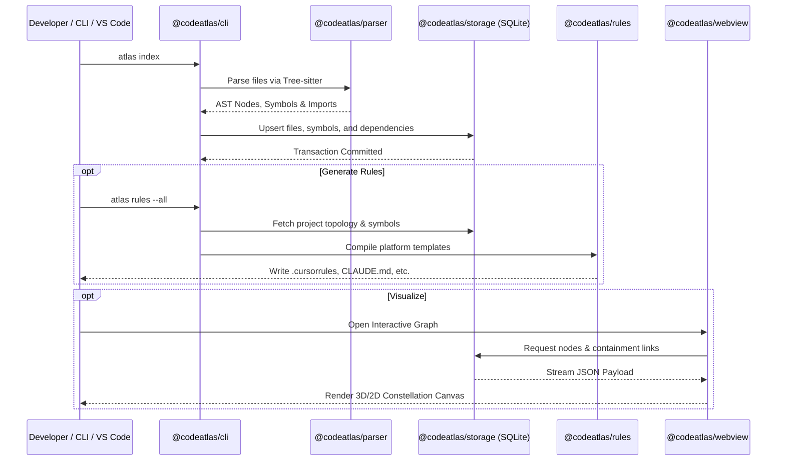

# System Architecture

CodeAtlas is organized as a decoupled, modular TypeScript monorepo operating under strict domain-driven boundaries.

---

## Monorepo Architecture

```
CodeAtlas/
├── packages/
│   ├── core/           Domain models, interfaces, and shared types
│   ├── parser/         Multi-language Tree-sitter AST extraction pipeline
│   ├── storage/        SQLite persistent repository and schema management
│   ├── graph/          In-memory directed graph algorithms and topological sorters
│   ├── rules/          Template engine and AI prompt exporter
│   ├── compression/    Token optimization and symbol summarizer
│   ├── retrieval/      BM25 ranking and lexical indexer
│   └── mcp/            Model Context Protocol server implementation
└── apps/
    ├── cli/            Command-line application entry point (`atlas`)
    ├── vscode-extension/ Official Visual Studio Code extension
    ├── webview/        React force-directed graph web application
    └── docs/           VitePress documentation site
```

---

## End-to-End Execution Flow



---

## Package Responsibilities

### `@codeatlas/core`

The central domain layer containing zero external runtime dependencies. Defines all canonical interfaces (`Project`, `SourceFile`, `SymbolInfo`, `DependencyLink`, `RuleConfig`).

### `@codeatlas/parser`

Orchestrates language-specific grammars (`tree-sitter-typescript`, `tree-sitter-javascript`, `tree-sitter-python`, `tree-sitter-php`, `tree-sitter-go`, `tree-sitter-rust`). Extracts signatures, comments, and normalized imports.

### `@codeatlas/storage`

Encapsulates SQLite interactions using `better-sqlite3`. Manages database schema migrations, connection pooling, and repository query optimizations.

### `@codeatlas/graph`

Maintains an in-memory graph data structure using adjacency lists. Implements algorithms for cycle detection, reachability analysis, and critical path analysis.

### `@codeatlas/rules`

Generates target-specific configuration files for AI coding agents. Uses deterministic templating to combine project metadata, linter rules, and architectural guidelines.
