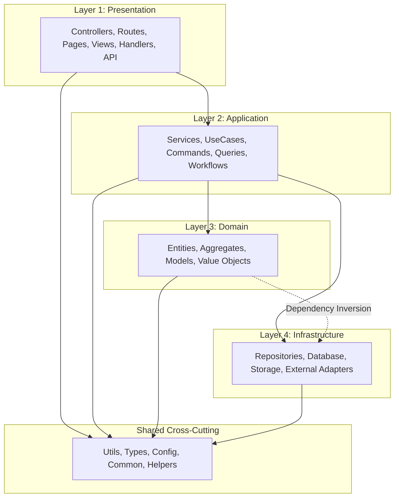
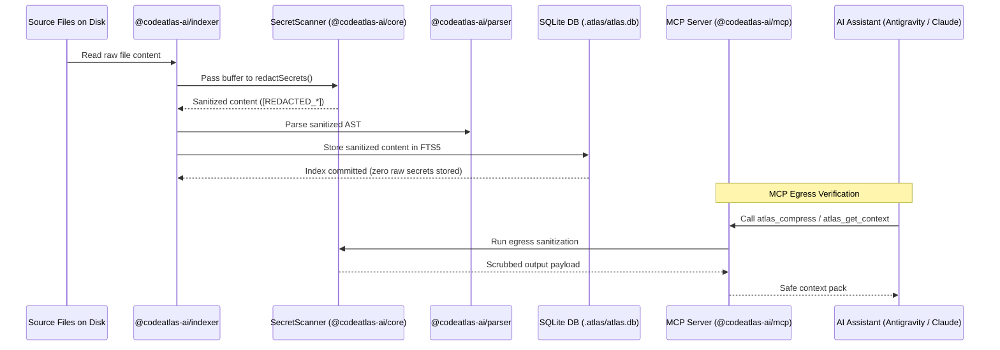

# System Architecture

CodeAtlas is organized as a decoupled, modular TypeScript monorepo operating under strict domain-driven boundaries and local-first execution principles.

---

## Monorepo Architecture

```
CodeAtlas/
├── packages/
│   ├── core/           Domain models, interfaces, language registry, SecretScanner
│   ├── parser/         Tree-sitter AST, TypeScript semantic resolver, Framework adapters
│   ├── storage/        SQLite persistent repository, migrations (1-5), and FTS5 search
│   ├── graph/          In-memory directed acyclic graph (DAG) and Cypher engine
│   ├── rules/          Evidence-based rule generator, conflict validator, prompt exporter
│   ├── compression/    AST skeletonizer and token budget compressor
│   ├── retrieval/      Task-intent BM25 and graph proximity retrieval engine
│   ├── ranking/        Multi-factor PageRank and temporal churn ranker
│   ├── analytics/      Architecture analyzer (DDD layers, regressions), dead code & taint
│   ├── git/            Git diff, temporal churn metrics, and commit tracker
│   └── mcp/            16 Model Context Protocol server tools implementation
└── apps/
    ├── cli/            Command-line application entry point (`atlas`)
    ├── vscode-extension/ Official Visual Studio Code & Cursor extension
    ├── webview/        React force-directed graph web application
    ├── mcp-server/     Standalone stdio MCP server executable
    └── docs/           VitePress documentation site
```

---

## 🏛️ True Architecture Model (DDD Layering)

CodeAtlas analyzes code structures against standard **Domain-Driven Design (DDD) & Clean Architecture** layering:



### Architectural Regressions Detected:

1. **`LAYER_REGRESSION`**:
   - **Presentation Calling Infrastructure**: Bypassing the service layer (e.g. a Next.js `page.tsx` or `Controller` importing a database `Repository` directly).
   - **Domain Depending on Infrastructure**: Direct imports from domain entities to database adapters (violating Dependency Inversion).
   - **Application Depending on Presentation**: Inverted upstream imports.
2. **`BOUNDED_CONTEXT_LEAK` & `PUBLIC_API_BYPASS`**:
   - Modules importing internal/private files from another module (e.g. `import { helper } from '../billing/internal/foo'`) rather than the public module entry point (`../billing/index.ts`).
3. **CI/CD Quality Gate**:
   - Running `atlas analyze --architecture --fail-on-architecture` automatically fails pull requests if architectural regressions are detected.

---

## 🔒 Secret Redaction Pipeline



---

## Package Responsibilities

### `@codeatlas-ai/core`
The central domain layer. Defines all canonical interfaces (`SymbolInfo`, `FileInfo`, `ContextPack`, `RuleConfig`), language mappings, and the **`SecretScanner`** engine with high-entropy entropy filters.

### `@codeatlas-ai/parser`
Tree-sitter AST extraction pipeline, **TypeScript Semantic Resolver** (inheritance and `@/*` aliases), and **Framework Adapters** (React Hooks, Next.js App Router, NestJS DI, Prisma Schema).

### `@codeatlas-ai/storage`
Encapsulates SQLite interactions via Node 22 native `node:sqlite`. Manages WAL mode, composite indexes, FTS5 full-text search, and database migrations (1–5).

### `@codeatlas-ai/analytics`
The **`ArchitectureAnalyzer`** performs automatic DDD layer classification, detects layer regressions and context leaks, computes project Clean Scores, and runs SAST security taint tracking.

### `@codeatlas-ai/rules`
The **`RuleGenerator`** inspects project evidence (`tsconfig.json`, `package.json`, test configurations) and produces evidence-backed guidelines for Antigravity (`AGENTS.md`), Claude (`CLAUDE.md`), and Cursor (`.cursorrules`).

### `@codeatlas-ai/mcp`
Model Context Protocol server implementing 16 AI tools for deep call graph tracing, symbol blast radius calculations, architectural sanity audits, and feature implementation blueprints.
