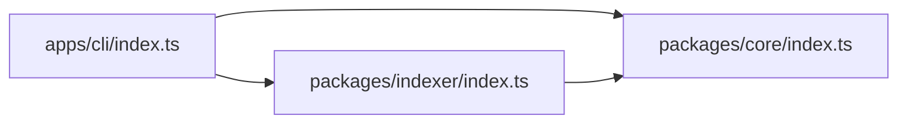

# 🧩 Core Concepts

Understanding how CodeAtlas works under the hood will help you get the most out of your AI coding assistants.

---

## 1. Abstract Syntax Tree (AST) vs Plain Text

Most code search tools look at your code as **dumb text**—they just search for words.

**CodeAtlas sees code as structure (AST):**
Using [Tree-sitter](https://tree-sitter.github.io/tree-sitter/), CodeAtlas understands the semantic structure of your programming languages:
- It knows `class UserService` is a class definition, not just a random sentence.
- It extracts function parameters, return types, and interface contracts.
- It tracks exact import and export bindings across files.

---

## 2. The Dependency Graph

Every file in your project is a **Node**, and every `import` or `require` is an **Edge** connecting them.

By storing this graph in a local embedded SQLite database (`.atlas/atlas.db`), CodeAtlas can answer complex architectural questions in milliseconds:
- *What files will break if I change this function?* (`atlas diff`)
- *Are there any circular dependencies?* (`atlas analyze --cycles`)
- *Which files are completely unused?* (`atlas analyze --dead-code`)

---

## 3. Token Budgeting & AST Skeletons

LLMs charge money and run slower when given too much text.

When you ask for context using `atlas context "task" --budget 4000`, CodeAtlas doesn't dump the whole repository. Instead:
1. It uses BM25 full-text search and graph traversal to find the top most relevant files.
2. If a file is too large, it compresses it into an **AST Skeleton**—keeping all class, method, and function signatures while stripping inner implementation details.
3. The AI gets 100% of the type and interface context using only 20% of the token budget!

---

## 4. Local-First & 100% Private

Your code never leaves your computer:
- No telemetry or cloud syncing.
- All databases and indexes live inside the `.atlas/` folder in your project.
- Works 100% offline on air-gapped machines.
