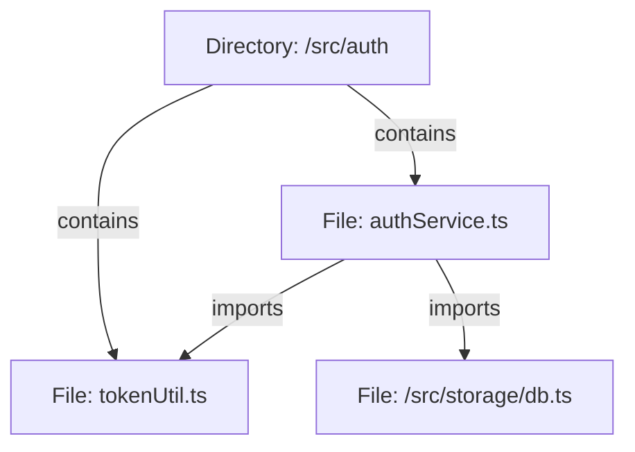

# Core Concepts

This section covers the underlying theoretical and engineering principles governing CodeAtlas.

---

## 1. Concrete Syntax Trees vs. Abstract Syntax Trees (AST)

Traditional text-based indexing tools (such as ripgrep or standard keyword indexers) operate strictly at the lexical byte level. While fast, they lack semantic awareness regarding code scopes, variable hoisting, type annotations, and module bindings.

CodeAtlas implements a language-specific AST pipeline powered by Tree-sitter. By constructing formal grammar trees, CodeAtlas unambiguously identifies:

- **Top-Level Declarations**: Distinguishing between internal helper functions and exported API surfaces.
- **Syntactic Enclosures**: Tracking exact byte offsets, start/end line coordinates, and cyclomatic complexity.
- **Import Statements**: Normalizing dynamic imports (`import()`), CommonJS (`require()`), and ES Module statements into a unified dependency graph.

---

## 2. In-Memory and Persistent Dependency Graphs

CodeAtlas models codebase topology as a directed graph $G = (V, E)$:

- **Vertices ($V$)**: Represent entities such as directories, files, classes, interfaces, and functions.
- **Edges ($E$)**: Represent relationships with typed attributes:
  - `contains`: Directory-to-file structural containment.
  - `imports`: Static or dynamic module imports.
  - `implements` / `extends`: Object-oriented inheritance and interface contracts.
  - `calls`: Cross-module function or method invocations.

---

## 3. Context Pack Compilation & Token Optimization

Language models operate under finite token budgets. Passing raw file contents rapidly exhausts context windows and degrades comprehension.

CodeAtlas implements a two-stage context packing engine:

### Stage 1: AST Structural Summarization

Function and method implementations are stripped of internal control flow while preserving signature contracts, parameter types, return values, and JSDoc/docstring annotations.

### Stage 2: Relevance Scoring

When preparing a context pack for a user query or agent instruction, CodeAtlas calculates composite relevance scores combining:

- **Lexical BM25 Score**: Keyword frequency matched across symbol names and docstrings.
- **Topological Distance**: Shortest path distance in the dependency graph from currently active or modified files.
- **Recency & Scope Weight**: Prioritizing entry points and architectural boundaries.
