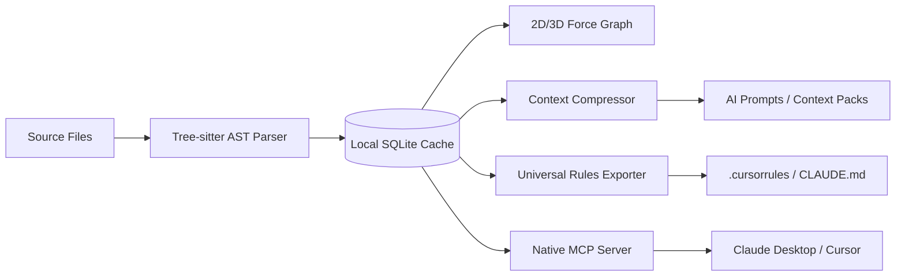

# Overview

CodeAtlas is an AI context intelligence and interactive architecture engine designed for software engineering teams working on large, complex codebases.

---

## Architectural Challenges in AI-Assisted Engineering

Modern Large Language Models (LLMs) have transformed software development, yet their effectiveness remains constrained by fundamental contextual limitations:

1. **Context Window Degradation ("Lost in the Middle")**: Passing entire repositories into prompt windows causes massive token costs, high latency, and severe retrieval degradation.
2. **Missing Dependency Graphs**: Without structural understanding of how modules, classes, and interfaces interconnect, AI agents frequently generate code that introduces circular dependencies or breaks existing abstractions.
3. **Drift in AI Rule Specifications**: Manually maintaining synchronized `.cursorrules`, `CLAUDE.md`, or `AGENTS.md` files across multiple repositories quickly becomes unmaintainable.
4. **Spatial Opacity**: Engineers lack an immediate, interactive topological overview of how packages and files relate to one another.

---

## Core Solutions Provided by CodeAtlas

### 1. High-Throughput AST Indexer

Analyzes code syntax trees using Tree-sitter parsers to extract symbol declarations (functions, classes, interfaces, types) and import/export bindings in milliseconds.

### 2. Interactive Constellation Graph

Renders 3D and 2D spatial layouts of your codebase. Nodes represent files and directories; edges represent imports, call references, and containment hierarchies.

### 3. Universal AI Agent Rule Exporter

Compiles repository architecture, coding guidelines, domain models, and package constraints into native prompt formats for Cursor, Windsurf, Claude, Devin, Roo Code, Aider, and OpenHands.

### 4. Native Model Context Protocol (MCP) Server

Allows external AI agents to query the codebase topology, symbol definitions, and dependency trees via standardized JSON-RPC protocols.

### 5. Local-First Privacy

All AST parsing, SQLite caching, graph rendering, and rule compilation execute strictly on your local machine with zero external network dependencies.

---

## Next Steps

- [Getting Started](/guide/getting-started) — Install the CLI and configure your first repository.
- [System Architecture](/guide/architecture) — Deep-dive into internal package mechanics.
- [AI Rules Exporter](/guide/rules-export) — Learn how to generate tailored instructions for your AI editors.
