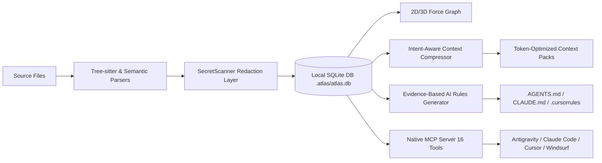

# Overview

CodeAtlas is an AI context intelligence and interactive architecture engine designed for software engineering teams working on modern, complex codebases.

---

## Architectural Challenges in AI-Assisted Engineering

Modern Large Language Models (LLMs) have transformed software development, yet their effectiveness remains constrained by fundamental contextual limitations:

1. **Context Window Degradation ("Lost in the Middle")**: Passing entire repositories into prompt windows causes massive token costs, high latency, and severe retrieval degradation.
2. **Context Blindness & Architectural Regressions**: Without structural understanding of DDD layers, call graphs, or module boundaries, AI agents generate hallucinated imports, introduce circular dependencies, or bypass public APIs.
3. **Secret Leakage Risks**: Unchecked indexing can inadvertently send proprietary API keys, JWT tokens, and database credentials to external LLMs.
4. **Framework Idiom Misinterpretation**: Generic parsers fail to recognize higher-level semantics like React Custom Hooks, Next.js App Router conventions, or NestJS Dependency Injection.

---

## Core Solutions Provided by CodeAtlas

### 1. High-Throughput AST & Semantic Parser

Analyzes code syntax trees using Tree-sitter parsers and semantic resolvers to extract symbol declarations, type inheritance (`extends`/`implements`), path mappings (`@/*`), and framework primitives in milliseconds.

### 2. Automated Secret Redaction Layer

Scans file content _in-memory_ with high-entropy regex patterns, replacing cloud keys (Anthropic, OpenAI, AWS, GCP, GitHub), JWTs, and database passwords with redaction tokens before indexing or sending to LLMs.

### 3. Framework-Specific Semantics

Understands conventions natively: React Hooks (`use*`), Next.js App Router (`page.tsx`, `layout.tsx`, `route.ts`), NestJS Dependency Injection (`@Controller`, `@Injectable`, `@Module`), and Prisma Schema (`.prisma` models, enums, relations).

### 4. True Architecture DDD Guardrails

Automatically classifies files into 5 domain-driven layers (Presentation, Application, Domain, Infrastructure, Shared) and enforces architectural boundaries with `atlas analyze --architecture`.

### 5. Native Model Context Protocol (MCP) Server (16 Tools)

Allows external AI agents to query codebase topology, trace call hierarchies (`atlas_trace_execution_path`), discover entry points (`atlas_find_entry_points`), and plan complex features (`atlas_plan_feature`).

### 6. Local-First Privacy

All AST parsing, SQLite caching, graph rendering, and rule compilation execute strictly on your local machine with zero telemetry.

---

## Next Steps

- [Getting Started](/guide/getting-started) — Install the CLI and configure your first repository.
- [System Architecture](/guide/architecture) — Deep-dive into internal package mechanics and DDD layering.
- [Model Context Protocol (MCP)](/guide/mcp) — Connect CodeAtlas directly to Antigravity, Claude, and Cursor.
- [AI Rules Exporter](/guide/rules-export) — Learn how to generate evidence-backed instructions for your AI assistants.
