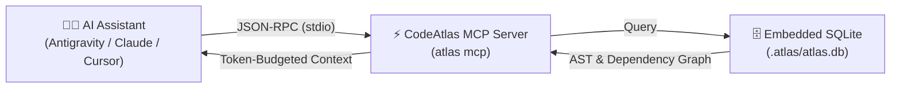

# 🔌 Model Context Protocol (MCP) Integration

The **Model Context Protocol (MCP)** is an open standard created by Anthropic that allows AI assistants (like Claude, Antigravity, and Cursor) to securely connect to external tools and data sources.

Instead of your AI guessing what your files contain, CodeAtlas runs an MCP server that acts as a **real-time query engine** directly inside your AI's thought process.

---

## 🧠 How It Works Behind the Scenes



1. You install and configure the CodeAtlas MCP server once.
2. When you ask your AI assistant a question (e.g. *"Fix the database connection issue"*), the AI calls CodeAtlas MCP tools automatically.
3. CodeAtlas extracts the exact AST definitions, functions, and import graphs from SQLite and returns a compressed summary.
4. Your AI writes accurate code without hallucinations and saves up to 80% on tokens!

---

## 🛠️ Step-by-Step Configuration Guide

### 1. Google Antigravity

Antigravity natively loads MCP servers configured in `.agents/mcp_config.json` (for project-level) or `~/.gemini/config/mcp_config.json` (for global).

Create or edit `.agents/mcp_config.json` in your repository root:

```json
{
  "mcpServers": {
    "codeatlas": {
      "command": "atlas",
      "args": ["mcp"]
    }
  }
}
```

---

### 2. Claude Code CLI

Connect CodeAtlas to your Claude Code command line tool with a single command:

```bash
claude mcp add codeatlas atlas -- mcp
```

---

### 3. Claude Desktop

Add CodeAtlas to your Claude Desktop configuration file:

- **Windows**: `%APPDATA%\Claude\claude_desktop_config.json`
- **macOS**: `~/Library/Application Support/Claude/claude_desktop_config.json`
- **Linux**: `~/.config/Claude/claude_desktop_config.json`

```json
{
  "mcpServers": {
    "codeatlas": {
      "command": "atlas",
      "args": ["mcp"]
    }
  }
}
```

---

### 4. Cursor / Windsurf / Cline / Roo Code

Add to your editor's MCP settings:

```json
{
  "mcpServers": {
    "codeatlas": {
      "command": "atlas",
      "args": ["mcp"],
      "type": "stdio"
    }
  }
}
```

---

## 🧰 Available MCP Tools (The 11 Superpowers)

Once connected, your AI assistant will have access to the following 11 tools:

| Tool Name | Description | What the AI Uses It For |
| :--- | :--- | :--- |
| `atlas_scan` | Scans workspace metadata, languages, and monorepo structure. | Discovering project layout and stack. |
| `atlas_index` | Updates the local AST symbol and dependency graph. | Refreshing index after editing files. |
| `atlas_search` | Full-text FTS5 BM25 search across symbols and files. | Finding specific classes, functions, or keywords. |
| `atlas_get_context` | Retrieves token-budgeted, explainable code context packs. | Gathering all relevant files before implementing a feature. |
| `atlas_graph_query` | Executes Cypher queries over the codebase graph. | Answering complex relationship questions (e.g. *Who calls this API?*). |
| `atlas_pr_diff` | Analyzes git diffs and calculates blast radius. | Pre-commit impact analysis and code review. |
| `atlas_compress` | Compresses source code into AST signature skeletons. | Reading large files within tight token budgets. |
| `atlas_get_map` | Returns hierarchical directory tree and exported symbols. | High-level codebase navigation. |
| `atlas_get_rules` | Discovers and validates project AI coding rules. | Ensuring adherence to project coding standards. |
| `atlas_doctor` | Runs repository health checks. | Diagnosing missing indexes or rule conflicts. |
| `atlas_analyze` | Audits dead code, circular dependencies, and hotspots. | Architecture quality control before completing tasks. |
