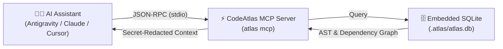

# 🔌 Model Context Protocol (MCP) Integration

The **Model Context Protocol (MCP)** is an open standard created by Anthropic that allows AI assistants (like Claude, Antigravity, Cursor, and Windsurf) to securely connect to external tools and data sources.

Instead of your AI guessing what your files contain, CodeAtlas runs an MCP server that acts as a **real-time architectural query engine** directly inside your AI's thought process.

---

## 🧠 How It Works Behind the Scenes



1. You install and configure the CodeAtlas MCP server once.
2. When you ask your AI assistant a question (e.g. _"Fix the database connection issue"_ or _"Implement the new billing flow"_), the AI calls CodeAtlas MCP tools automatically.
3. CodeAtlas extracts exact AST definitions, functions, and import graphs from SQLite and returns a compressed, secret-redacted summary.
4. Your AI writes accurate code without hallucinations and saves up to 92% on tokens!

---

## ⚡ 1-Click Automated Configuration (Recommended)

Instead of manually editing hidden JSON files across different directories, CodeAtlas includes an enterprise-grade **Universal MCP Auto-Configurator**:

```bash
# Interactive setup: auto-detects installed assistants and lets you pick
atlas mcp setup

# Or non-interactively configure all detected AI assistants:
atlas mcp setup --all

# Or configure specific assistants by target ID:
atlas mcp setup --target cursor antigravity claude-desktop windsurf roo trae zed continue
```

### 📋 View Supported AI Assistants & Detection Status

Run the following command to see all 14+ supported AI coding assistants, their target config paths, and whether they are detected on your machine:

```bash
atlas mcp list-targets
```

---

## 🛠️ Supported AI Coding Assistants Matrix

CodeAtlas automatically performs **safe non-destructive merges** and creates `.bak` backups before modifying configurations:

| Assistant                      | Type               | Configuration Path                                                                          | Format / Schema                       |
| :----------------------------- | :----------------- | :------------------------------------------------------------------------------------------ | :------------------------------------ |
| **Google Antigravity & Codex** | Workspace & Global | `.agents/mcp_config.json`<br>`~/.gemini/config/mcp_config.json`                             | `mcpServers.codeatlas`                |
| **Cursor**                     | Workspace & Global | `.cursor/mcp.json`<br>`~/.cursor/mcp.json`                                                  | `mcpServers.codeatlas`                |
| **Claude Code CLI**            | CLI & Workspace    | Auto `claude mcp add` & `.claude.json`                                                      | `mcpServers.codeatlas`                |
| **Claude Desktop**             | Global AppData     | `%APPDATA%\Claude\claude_desktop_config.json`<br>`~/Library/Application Support/Claude/...` | `mcpServers.codeatlas`                |
| **Windsurf (Cascade)**         | Global & Workspace | `~/.codeium/windsurf/mcp_config.json`<br>`.windsurf/mcp.json`                               | `mcpServers.codeatlas`                |
| **Roo Code (VS Code)**         | Global Storage     | `cline_mcp_settings.json` (Roo Code extension)                                              | `mcpServers.codeatlas` (auto-enabled) |
| **Cline (VS Code)**            | Global Storage     | `cline_mcp_settings.json` (Cline extension)                                                 | `mcpServers.codeatlas` (auto-enabled) |
| **Trae IDE**                   | Workspace & Global | `.trae/mcp.json` & `~/.trae/mcp.json`                                                       | `mcpServers.codeatlas`                |
| **Zed Editor**                 | Global Settings    | `~/.config/zed/settings.json` / `%APPDATA%\Zed`                                             | `context_servers.codeatlas`           |
| **Continue.dev**               | Workspace & Global | `.continue/config.json` & `~/.continue/...`                                                 | `modelContextProtocolServers[]`       |
| **OpenHands & Devin**          | Workspace          | `.openhands/mcp.json`                                                                       | `mcpServers.codeatlas`                |
| **Amazon Q Developer**         | Global             | `~/.aws/amazonq/mcp.json`                                                                   | `mcpServers.codeatlas`                |
| **Universal Fallback**         | Workspace          | `.mcp.json`                                                                                 | `mcpServers.codeatlas`                |

---

## 📝 Manual Configuration Reference (Optional)

If you prefer manual setup, add the following to your AI assistant's configuration file:

### 1. Google Antigravity & Codex

Add to `.agents/mcp_config.json` in your workspace root:

```json
{
  "mcpServers": {
    "codeatlas": {
      "command": "atlas",
      "args": ["mcp"]
    }
  }
}
```

### 2. Cursor

Add to `.cursor/mcp.json` in your workspace root:

```json
{
  "mcpServers": {
    "codeatlas": {
      "command": "atlas",
      "args": ["mcp"]
    }
  }
}
```

### 3. Claude Code CLI

```bash
claude mcp add codeatlas atlas -- mcp
```

### 4. Claude Desktop

Add to `%APPDATA%\Claude\claude_desktop_config.json` (Windows) or `~/Library/Application Support/Claude/claude_desktop_config.json` (macOS):

```json
{
  "mcpServers": {
    "codeatlas": {
      "command": "atlas",
      "args": ["mcp"]
    }
  }
}
```

### 5. Windsurf (Cascade)

Add to `~/.codeium/windsurf/mcp_config.json`:

```json
{
  "mcpServers": {
    "codeatlas": {
      "command": "atlas",
      "args": ["mcp"]
    }
  }
}
```

---

## 🧰 The 22 CodeAtlas MCP Tools

Once connected, your AI assistant will have access to the following 22 specialized tools:

| Tool Name                        | Category           | Description & Purpose                                                                                 |
| :------------------------------- | :----------------- | :---------------------------------------------------------------------------------------------------- |
| `atlas_scan`                     | Exploration        | Scans workspace metadata, programming languages, and monorepo package layout.                         |
| `atlas_index`                    | Core Engine        | Updates local AST symbols, dependencies, and temporal git metrics with automatic secret redaction.    |
| `atlas_search`                   | Search             | Full-text FTS5 BM25 search across symbols and files (secrets automatically redacted).                 |
| `atlas_search_symbols`           | Search             | Fast targeted symbol lookup by name, kind, or file path across the entire codebase.                   |
| `atlas_get_context`              | Context Packing    | Intent-driven (`bug`/`feature`/`refactor`) token-budgeted prompt packs with directory tree structure. |
| `atlas_get_file_context`         | Context Packing    | Targeted context for a specific file, its immediate imports, and dependents.                          |
| `atlas_dependencies`             | Graph Topology     | Direct incoming and outgoing dependency mapping for any file.                                         |
| `atlas_cycles`                   | Graph Topology     | Detects circular import chains and dependency cycles using Tarjan's SCC algorithm.                    |
| `atlas_impact`                   | Impact Analysis    | Computes direct and cascading blast radius if a file or symbol is modified.                           |
| `atlas_pr_diff`                  | Impact Analysis    | Analyzes git diffs, calculates downstream blast radius, and flags breaking edits.                     |
| `atlas_calculate_change_surface` | Impact Analysis    | Pre-PR simulation of downstream impact across all dependents before making edits.                     |
| `atlas_graph_query`              | Graph Query        | Executes Cypher graph traversal queries across code dependencies.                                     |
| `atlas_architecture`             | Architecture       | High-level architecture map, layer boundaries, and cluster topology.                                  |
| `atlas_analyze`                  | Health & Linting   | Audits DDD layer regressions, circular imports, dead code, and temporal git churn hotspots.           |
| `atlas_get_god_components`       | Health & Linting   | Identifies high-complexity, high-churn files that pose architectural risk.                            |
| `atlas_get_dead_code`            | Health & Linting   | Detects unreachable files, orphaned functions, and unused exports.                                    |
| `atlas_get_bottlenecks`          | Health & Linting   | Uncovers architectural bottlenecks and high-centrality bridge nodes.                                  |
| `atlas_suggest_refactoring`      | Health & Linting   | Suggests refactoring opportunities to decouple tightly bound components.                              |
| `atlas_compress`                 | Token Saving       | Compresses source code into AST signature skeletons with in-memory secret scrubbing.                  |
| `atlas_get_map`                  | Visual Navigation  | Returns hierarchical directory tree and exported symbols for codebase navigation.                     |
| `atlas_get_rules`                | Rules & Governance | Discovers and validates project AI coding rules across all formats (`AGENTS.md`, `CLAUDE.md`, etc.).  |
| `atlas_generate_rules`           | Rules & Governance | Generates evidence-backed AI guidelines based on live DAG analysis.                                   |

---

## 🔒 Built-In Security Redaction Guarantee

Every tool that reads or compresses code (`atlas_compress`, `atlas_get_context`, `atlas_search`, `atlas_security_audit`) routes its output through the `SecretScanner` redaction layer.

Private keys, Cloud API keys (Anthropic, OpenAI, AWS, GCP, GitHub), JWT tokens, and database connection passwords are automatically replaced with sanitization placeholders before the JSON-RPC response reaches the LLM.
