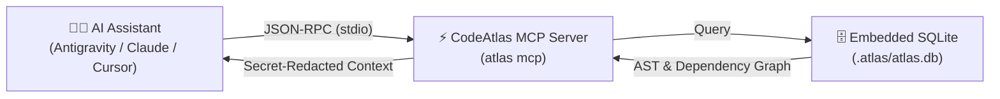

# 🔌 Model Context Protocol (MCP) Integration

The **Model Context Protocol (MCP)** is an open standard created by Anthropic that allows AI assistants (like Claude, Antigravity, Cursor, and Windsurf) to securely connect to external tools and data sources.

Instead of your AI guessing what your files contain, CodeAtlas runs an MCP server that acts as a **real-time architectural query engine** directly inside your AI's thought process.

---

## 🧠 How It Works Behind the Scenes



1. You install and configure the CodeAtlas MCP server once.
2. When you ask your AI assistant a question (e.g. _"Fix the database connection issue"_ or _"Implement the new billing flow"_), the AI calls CodeAtlas MCP tools automatically.
3. CodeAtlas extracts exact AST definitions, functions, and import graphs from SQLite and returns a compressed, secret-redacted summary.
4. Your AI writes accurate code without hallucinations and saves up to 92% on tokens!

---

## 🛠️ Step-by-Step Configuration Guide

### 1. Google Antigravity

Antigravity natively loads MCP servers configured in `.agents/mcp_config.json` (for project-level) or `~/.gemini/config/mcp_config.json` (for global).

Create or edit `.agents/mcp_config.json` in your repository root:

```json
{
  "mcpServers": {
    "codeatlas": {
      "command": "atlas",
      "args": ["mcp"]
    }
  }
}
```

---

### 2. Claude Code CLI

Connect CodeAtlas to your Claude Code command line tool with a single command:

```bash
claude mcp add codeatlas atlas -- mcp
```

---

### 3. Claude Desktop

Add CodeAtlas to your Claude Desktop configuration file:

- **Windows**: `%APPDATA%\Claude\claude_desktop_config.json`
- **macOS**: `~/Library/Application Support/Claude/claude_desktop_config.json`
- **Linux**: `~/.config/Claude/claude_desktop_config.json`

```json
{
  "mcpServers": {
    "codeatlas": {
      "command": "atlas",
      "args": ["mcp"]
    }
  }
}
```

---

### 4. Cursor / Windsurf / Cline / Roo Code

Add to your editor's MCP settings:

```json
{
  "mcpServers": {
    "codeatlas": {
      "command": "atlas",
      "args": ["mcp"],
      "type": "stdio"
    }
  }
}
```

---

## 🧰 The 16 CodeAtlas MCP Tools

Once connected, your AI assistant will have access to the following 16 specialized tools:

| Tool Name                        | Category        | Description & Purpose                                                                                  |
| :------------------------------- | :-------------- | :----------------------------------------------------------------------------------------------------- |
| `atlas_scan`                     | Exploration     | Scans workspace metadata, programming languages, and monorepo workspace package layout.                |
| `atlas_index`                    | Core            | Updates local AST symbols, dependencies, and temporal git metrics with automatic secret redaction.     |
| `atlas_search`                   | Search          | Full-text FTS5 BM25 search across symbols and files (secrets automatically redacted).                  |
| `atlas_get_context`              | Context Packing | Intent-driven (`bug`/`feature`/`refactor`) token-budgeted prompt packs with directory tree structure.  |
| `atlas_graph_query`              | Graph           | Executes Cypher graph traversal queries across code dependencies.                                      |
| `atlas_pr_diff`                  | Impact Analysis | Analyzes git diffs, calculates downstream blast radius, and flags breaking edits.                      |
| `atlas_compress`                 | Token Saving    | Compresses source code into AST signature skeletons with in-memory secret scrubbing.                   |
| `atlas_get_map`                  | Visual          | Returns hierarchical directory tree and exported symbols for codebase navigation.                      |
| `atlas_get_rules`                | Rules           | Discovers and validates project AI coding rules across all formats (`AGENTS.md`, `CLAUDE.md`, etc.).   |
| `atlas_doctor`                   | Health          | Runs repository health checks and SQLite index integrity verification.                                 |
| `atlas_analyze`                  | Architecture    | Audits DDD layer regressions, circular imports, dead code, and temporal git churn hotspots.            |
| `atlas_trace_execution_path`     | Deep Tracing    | Traces call hierarchies upwards to entry points or downwards to leaf dependencies.                     |
| `atlas_find_entry_points`        | Architecture    | Identifies controllers, Next.js route handlers, CLI commands, and root exported functions.             |
| `atlas_calculate_change_surface` | Impact Analysis | Computes downstream blast radius for proposed symbol modifications before making changes.              |
| `atlas_security_audit`           | Security        | SAST security audit detecting injection vulnerabilities, sensitive credentials, and exposed endpoints. |
| `atlas_plan_feature`             | AI Blueprint    | Autonomous planning tool: generates step-by-step implementation blueprints and context files.          |

---

## 🔒 Built-In Security Redaction Guarantee

Every tool that reads or compresses code (`atlas_compress`, `atlas_get_context`, `atlas_search`, `atlas_security_audit`) routes its output through the `SecretScanner` redaction layer.

Private keys, Cloud API keys (Anthropic, OpenAI, AWS, GCP, GitHub), JWT tokens, and database connection passwords are automatically replaced with sanitization placeholders before the JSON-RPC response reaches the LLM.
