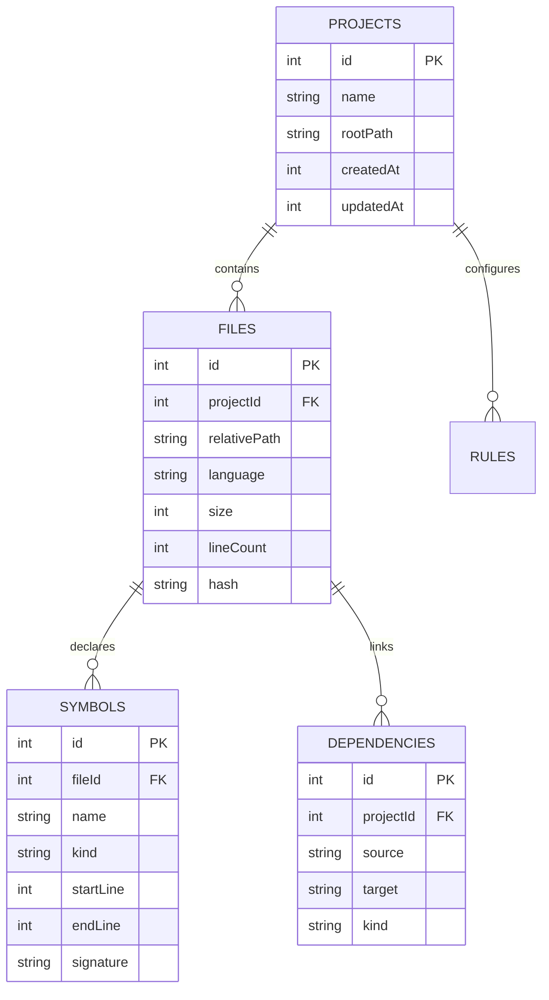

# Storage & Database Schema

The `@codeatlas/storage` package manages the embedded SQLite database located at `.atlas/codeatlas.db` within each indexed workspace.

---

## Entity Relational Diagram

---

## Performance Characteristics

- **WAL Mode Enabled**: Writes operate via Write-Ahead Logging (`PRAGMA journal_mode = WAL`), enabling concurrent non-blocking reads.
- **Synchronous Normal**: Optimized disk sync behavior (`PRAGMA synchronous = NORMAL`) for maximum indexing throughput.
- **Indexed Queries**: Composite B-tree indexes on `(projectId, relativePath)` and `(source, target)` ensure sub-millisecond graph query resolution.
